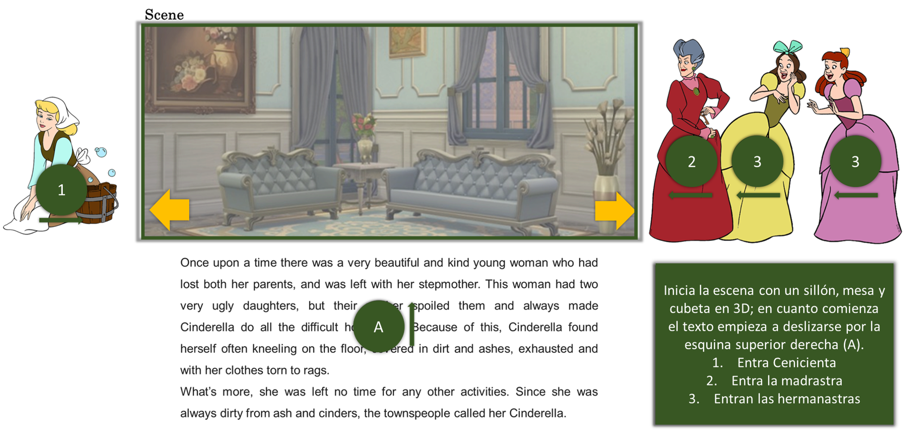
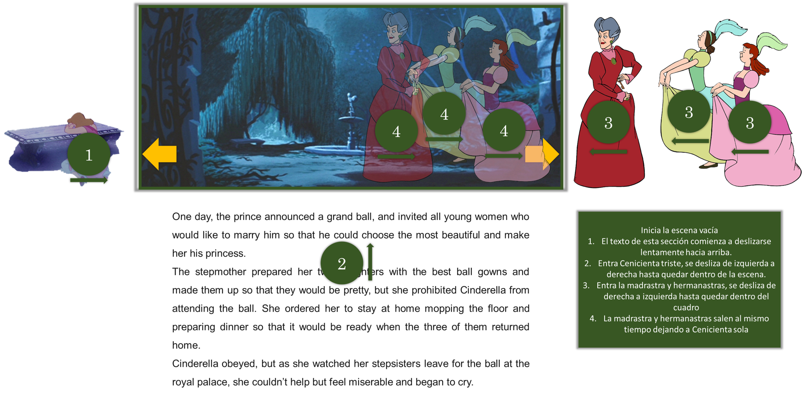
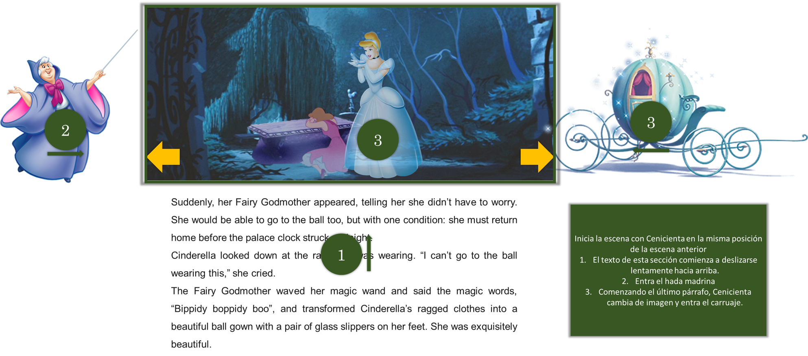
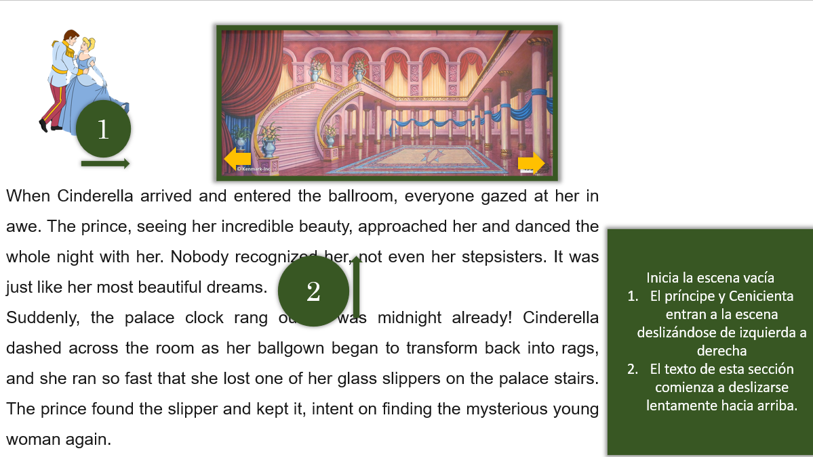
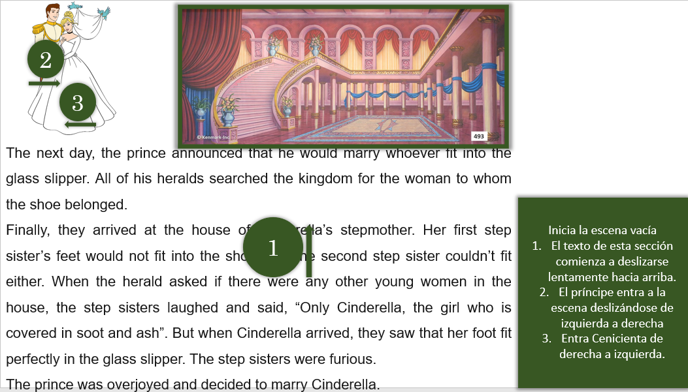

# Cinderella Story
## Equipo 3
##### Gabriel Schlam Huber - A01024122
##### Alejandra Nissan Leizorek - A01024682
##### Samantha Barco Mejia - A01196844

## Requerimientos funcionales
1. Crear un cuento interactivo para niños de 6 a 12 años.
2. Al inicio de cada escena, los personajes entrarán y realizarán una animación sencilla.
3. Habrá como mínimo dos objetos por cada escena con los que el usuario podrán interactuar.
4. La cámara tendrá movimiento en cada escena.
5. La historia del cuento aparecerá como texto, conforme al flujo de los personajes, para poder dar un seguimiento a la historia.
6. Habrá un total de seis escenas de la historia. A continuación se explicará cada una de ellas:
    * **Escena 1:**
    
    Esta escena será la portada, en ella lucirá la icónica zapatilla de cenicienta con y además una mariposa que estará postrada cerca del título. Para esta primera escena no queremos que la zapatilla y la mariposa entren, sino que siempre estará dentro para hacer lucir la portada. Además, estará el título y nuestros nombres.
        
        **Objetos interactuables:**
        - Zapatilla: al presionarla esta rotará en y para lucir su increíble diseño. 
        - Mariposa: cuando se presione hará un recorrido de vuelo. 

    * **Escena 2:**
    
    Esta escena ilustra lo infeliz que era Cenicienta, la escena comenzará con un sillón, mesa y cubeta, posteriormente entrará Cenicienta, luego madrastra y finalmente hermanastras. 
        
        **Objetos interactuables:**
        - Sillón y Cenicienta: cuando se presionen, la cubeta sacará burbujas.
        - Hermanastras: Saldrá un ratón caminando detrás de su madre. 

    * **Escena 3:**
    
    Cuando le prohíben a Cenicienta a acudir al baile que tanto deseaba ir. Entrará Cenicienta, luego su familia y finalmente saldrá su familia y se quedará sola en la escena.

        **Objetos interactuables:**
        - Fuente: la fuente sacará gotas de agua. 
        - Ratones: al presionar a Cenicienta aparecerán sus ratones a acompañarla. 

    * **Escena 4:**
    
    El hada madrina aparece para ayudar a Cenicienta a acudir al baile. Cenicienta ya estará en la escena, dado que ya estaba en ese lugar en la escena anterior. Luego, aparecerá el hada madrina y el carruaje. 
        
        **Objetos interactuables:**
        - Carruaje: al presionarlo se elevará del piso (flotará), girará y volverá a bajar. 
        - Hada madrina: Moverse de arriba hacia abajo, girando.

    * **Escena 5:**
    
    Cenicienta conoce al Príncipe y bailan juntos. Entran juntos a la escena. 
        
        **Objetos interactuables:**
        - Cenicienta y el Príncipe: comienzan a bailar en forma de infinito. 
        - Luz: cuando se presiona la columna, se prende y se apaga una luz que alumbra directamente al Príncipe y a Cenicienta.

    * **Escena 6:**
    
    Encuentran que a Cenicienta le queda perfectamente la zapatilla y se casa con el Príncipe. Entra el Príncipe del lado izquierdo y Cenicienta del derecho. 
        
        **Objetos interactuables:**
        - Ratones: al presionar la columna saldrán caminando. 
        - Pájaros: al presionarlos darán un recorrido de vuelo soltando pétalos de rosa y volverán a postrarse en el mismo sitio.

7. Implementar conocimiento de gráficos 3D y animaciones adquiridos en clase.

## ¿Cómo se van a cumplir los requerimientos?
* Se utilizarán personajes 2D, modelos 3D, con animaciones ya sea integradas o creadas por el equipo.
* Se utilizará un mecanismo para pasar de una escena a otra, por medio de botones de siguiente y anterior.
* Utilizaremos el método de raycasting para controlar la interacción entre el usuario y los objetos con animación.
* Utilizaremos el método de transformación de CSS a objetos 3D para animar el texto de la historia.
* De momento no consideramos utilizar alguna librería adicional, pero en el transcurso del proyecto este punto podría cambiar.

## Plan de trabajo
Nuestro plan de trabajo se dividirá en diferentes sprints, con diferentes entregables a medir.
### Primer Sprint: 02/11 - 09/11
1. Personajes 2D, modelos 3D recopilados, enlistando las animaciones que ya tiene el objeto. **¿Quién? -> Todo el equipo**
2. Cargar cada modelo y/o objeto a su respectiva escena y posición. **¿Quién? -> Todo el equipo, dividido por escenas**
3. Realizar flujo de botones de siguiente y anterior. **¿Quién? -> Gabriel**
### Segundo Sprint: 10/11 - 16/11
1. Animaciones de entrada y salida de personajes. **¿Quién? -> Todo el equipo, dividido por escenas, liderado por Alejandra**
2. Animaciones de objetos con interacción de usuario: movimiento y/o sonido (raycasting). **¿Quién? -> Todo el equipo, dividido por escenas, liderado por Samantha**
### Tercer Sprint: 17/11 - 26/11
1. Animaciones de texto de cuento. **¿Quién? -> Todo el equipo, dividido por escenas, liderado por Gabriel**
2. Loading Manager para optimizar carga de objetos. **¿Quién? -> Todo el equipo**

## Referencias Modelos 3D
**Escena 1:**
* Zapatillas: https://www.cgtrader.com/items/177103/download-page

**Escena 2:**
* Mesa: https://sketchfab.com/3d-models/classic-coffee-table-0b151b371da847d3a2dd960f9339eef1
* Cubeta: https://sketchfab.com/3d-models/old-wooden-bucket-7649d45e7d6f408b9b5929ab51895dfa
* Sillón: https://sketchfab.com/3d-models/sofa-a9695e97f8c74667a2c89f7d98ca3a9f

**Escena 3:**
* Fuente: https://sketchfab.com/3d-models/fountain-9812aa1535454df886fea502373edf08

**Escena 4:**
* Fuente: https://sketchfab.com/3d-models/fountain-9812aa1535454df886fea502373edf08
* Carruaje: https://www.blendswap.com/blend/9819

**Escena 5:**
* Columna: https://free3d.com/3d-model/white-column-44873.html
* Textura columna: https://www.pinterest.es/pin/825495806689115334/

**Escena 6:**
* Columna: https://free3d.com/3d-model/white-column-44873.html
* Textura columna: https://www.pinterest.es/pin/825495806689115334/
* Príncipe y cenicienta: https://www.jing.fm/iclipt/Thmwx/

## Referencias Modelos 2D
**Por orden de aparición**
* Mariposa: https://www.pngegg.com/es/png-dktlp
* Cenicienta limpiando: https://www.pinterest.es/pin/35465915803790189/
* Madrastra feliz: https://webstockreview.net/image/cinderella-clipart-cinderella-stepmother/2361020.html
* Hermanastras felices: https://www.disneyclips.com/images3/images/anastasia-drizella3.png
* Gus Gus: https://www.disneyclips.com/images3/images/gus5.png
* Cenicienta triste: https://fairytalesforfeminists.files.wordpress.com/2017/11/cinderella-cleaning-clipart-1.gif
* Madrastra baile: https://www.disneyclips.com/images3/images/anastasia-drizella.png
* Hermanastras baile: https://www.disneyclips.com/images3/images/lady-tremaine.png
* Jack Jack: https://www.disneyclips.com/images3/images/jaq2.png
* Hada Madrina: https://www.kindpng.com/imgv/xoiwTi_cinderella-fairy-godmother-the-walt-disney-company-cinderella/
* Cenicienta baile: http://pngimg.com/download/83469
* Principe baile: https://pnghut.com/png/9qk3rDJVwb/prince-charming-cinderella-grand-duke-clip-art-transparent-png
* Cenicienta y Principe boda: https://www.nicepng.com/ourpic/u2q8e6i1u2y3w7u2_cinderella-clock-silhouette-midnight-google-search-cinderella-and/
* Pájaros: https://www.pinterest.com.mx/pin/673640056751289629/
* Ratones: https://cdn140.picsart.com/322596818424211.png?type=webp&to=min&r=480
* Otras referencias: https://www.disneyclips.com/images3/cinderella-ladytremaine.html

