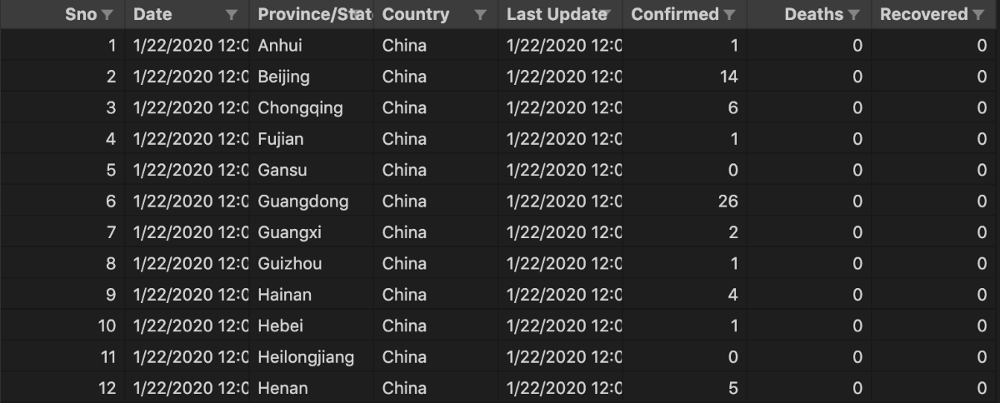
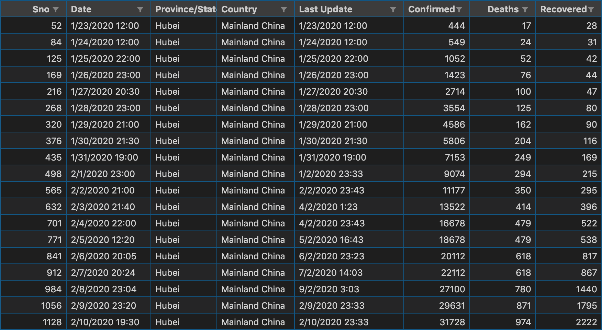
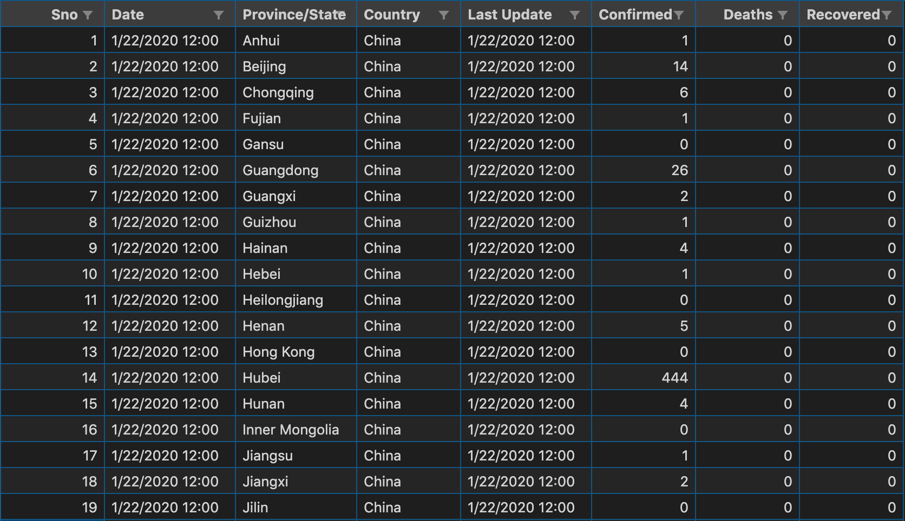
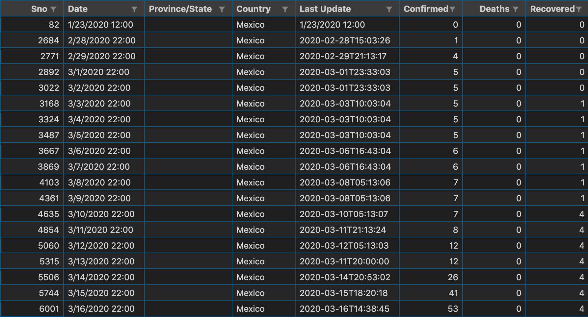
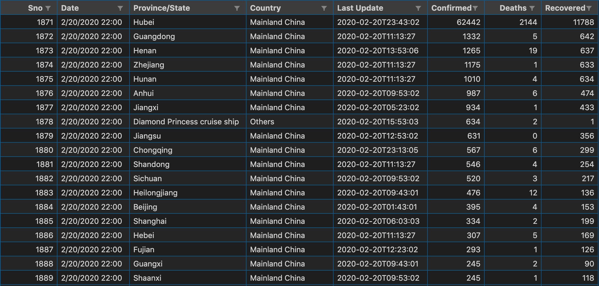
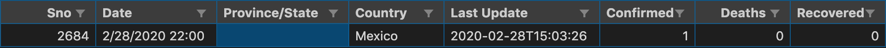
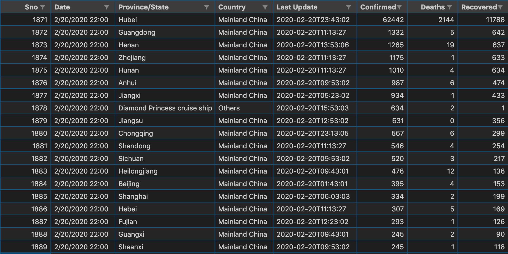
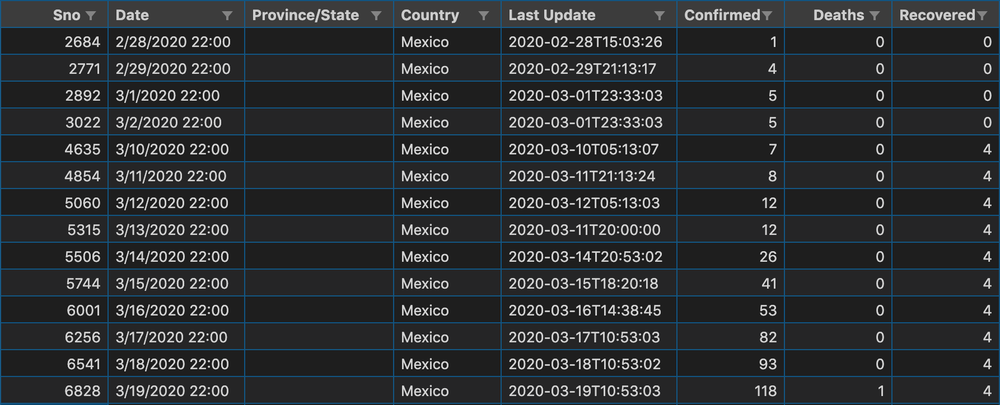
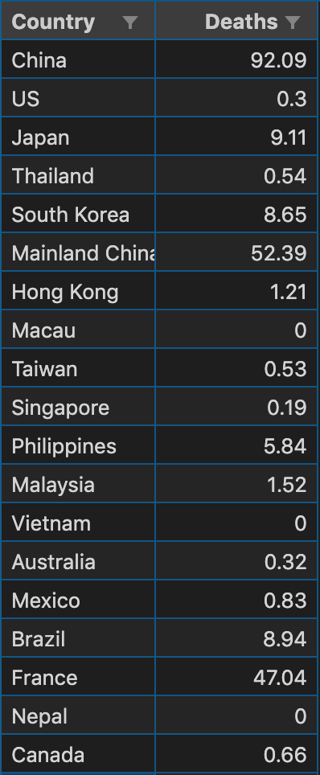
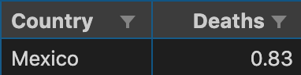

# Final Project : “What about the pandemic...”

---

### Team members:
1. *Gabriel Schlam Huber* - *A01024122*
2. *Daniel Roa González* - *A01021960*
2. *Sebastián Vives Faus* - *A01025211*

---
## 1. Project Description

A continuación aparecen descritos los diferentes elementos que forman parte de la solución de la tarea.

### 1.1 Problem to be solved

With the global pandemic increasing, countries are reporting higher infection rates, as well as increasing mortality rates. Countries have been giving their “official” (as far as we know) data involving the amount of **confirmed** cases, **deaths** and the amount of people that has **recovered**.

The main idea of our project is to get the overall amount of these fields per country and to show the user how these countries have been trying to fend off the global pandemic, with some filters for the user, so they can process the data in interest.

We set on this theme, mostly because of the current pandemic, but also, because a lot of people aren’t up to date with the situation on a global scale. By checking on it globally, we can try to give the information to the users, so they can predict an approximate date of when will we (as a country) be faced by the worst scenario, and when will the pandemic will start to decrease.

Also, we have noticed that the world is a little bit worried, mainly because they don’t get informed about the situation, causing panic. So this project can be helpful to reduce this paranoia.

### 1.2 Solution

The coding will be made in Racket. It will use the following library for reading CSV files: ```(require 2htdp/batch-io)```, calling the function ```read-csv-file```.

We are going to take a database with COVID-19 data ([2019_nCoV_data.csv](src/2019_nCoV_data.csv)), in CSV file, taken from: [COVID-19 Coronavirus Dataset](https://www.kaggle.com/vignesh1694/covid19-coronavirus/version/16), which includes the information regarding the topics we discussed, such as the following example:



In the section __1.4 Using the program__, we detail the way the program works, alongside the functions that it may contain.

After one of the processes is finished, the processed data will be saved into another CSV file, therefore, rendering the data visible to the user and allowing them to take a peek into the way COVID-19 is affecting each country on its own.

### 1.3 Topics in use
* **Functional programming:**
    * It is being used pure functions in our program, as seen in class.
    * It is being used basic operational functions (sum, subtract, multiply, divide, etc…) to help us query and group our data.
    * It is being used lists (more specifically a matrix of lists), to store the data of our CSV file.
    * It is being used loops in order to read each row and column from the CSV file.
* **Lists:**
    * It is being used a technique to process data by using multiple threads to read the information from the CSV faster and to process these data, depending on the user’s request.
    * The columns of the CSV will be stored in a list matrix, afterwards, these datasets will be grouped and specific queries will be made based on the information located in each one.
* **File Input/Output:**
    * It is being used file input to read the CSV file into our matrix of lists inside Racket.
    * It is being used file output to print our matrix of lists, after the data is processed, into a CSV file.

### 1.4 Using the program
#### 1.4.1 Set the program
1. **Install of Racket:** 
    * In order to use this software, it's vital that user has a working version of racket on their device.
    * In case they don't have one available, you can download it from [here](https://download.racket-lang.org/).
2. **Clone this repository:** 
    * It's recommended that the user also has the ability to clone GitHub repositories by using the terminal.
    * In order to do so, run the following command `git clone https://github.com/gabschlam/Programming-Languages-Project-COVID-19.git`
3. **Enter the program:**
    * In order to run the program, run the following commands on your command line or open your program on DrRacket.
        * The main file is in the _src_ folder, this one's called **proyectoCovid.rkt**, alongside it, you'll be able to find the CSV file from where the data is being read.
        * After accessing Racket's terminal, you'll need to open the program that contains the analyzing functions.
        * In order to do so, run the following command `(enter! "proyectoCovid.rkt")`.

#### 1.4.2 Use the possible functions:
In order to use the program correctly, you have one of the following options to choose from:
* **Get data from a specific country:** 
    * **Description:** This function will receive the input file, along with the country to process.
    * **Usage:** `(funcCountry ` *`file_name country`*`)`
    * **Example:** ```(funcCountry "2019_nCoV_data.csv" "Mexico")```
    * **Example of expected output:**
    

* **Get data from a specific set, from a minimum number:** 
    * **Description:** This function will receive the input file, along with the type of data to process, with “min”, and the number.
    By using min, the program will only print from the inserted value and to bigger values found in the CSV file.
    * **Usage:** `(funcMinMax ` *`file_name type `* `"min" ` *` number`*`)`
    * **Example:** ```(funcMinMax "2019_nCoV_data.csv" "Deaths" "min" 10)```
    * **Example of expected output:**
    

* **Get data from a specific set, from a maximum number:**
    * **Description:** This function will receive the input file, along with the type of data to process, with “max”, and the number.
    By using max, it will only print up until the inputted number, as an example, when inserting a 10, it will only go up to 10 and it will not print after that value. 
    * **Usage:** `(funcMinMax ` *`file_name type `* `"max" ` *` number`*`)`
    * **Example:** ```(funcMinMax "2019_nCoV_data.csv" "Recovered" "max" 10)```
    * **Example of expected output:**
    

* **Get data from a specific set, from a set of numbers, with a specific country:**
    * **Description:** This function will receive the input file, along with the type of data to process, with “min” or “max” as its options, the number the user wants to be processed and the country they want to extract data from.
    * **Usage:** `(funcMinMaxCountry ` *`file_name type country option number`*`)`
    * **Example:** ```(funcMinMaxCountry "2019_nCoV_data.csv" "Deaths" "Mexico" "max" 10)```
    * **Example of expected output:**
    

* **Get data from a specific date:**
    * **Description:** This function will receive the input file, along with the specific date the user wants to retrieve.
    * **Usage:** `(funcDate ` *`file_name date`*`)`
    * **Example:** ```(funcDate "2019_nCoV_data.csv" "2/20/2020")```
    * **Example of expected output:**
    

* **Get data from a specific date, and specific country:** 
    * **Description:** This function will receive the input file, along with the specific date the user wants to retrieve, with the country to process.
    * **Usage:** `(funcDateCountry ` *`file_name date country`*`)`
    * **Example:** ```(funcDateCountry "2019_nCoV_data.csv" "2/28/2020" "Mexico")```
    * **Example of expected output:**
    

* **Get data from a range of date:** 
    * **Description:** This function will receive the input file, along with the first date, followed by the second date.
    * **Usage:** `(funcDateRange ` *`file_name first_date last_date`*`)`
    * **Example:** ```(funcDateRange "2019_nCoV_data.csv" "2/20/2020" "3/20/2020")```
    * **Example of expected output:**
    

* **Get data from a range of date, and specific country:** 
    * **Description:** This function will receive the input file, along with the first date, followed by the second date, with the country to process.
    * **Usage:** `(funcDateRangeCountry ` *`file_name first_date last_date country`*`)`
    * **Example:** ```(funcDateRangeCountry "2019_nCoV_data.csv" "2/20/2020" "3/20/2020" "Mexico")```
    * **Example of expected output:**
    

* **Get data from a specific set:** 
    * **Description:** This function will receive the input file, alongside the column the user wants to see the average data from.
    * **Usage:** `(funcMean ` *`file_name type`*`)`
    * **Example:** ```(funcMean "2019_nCoV_data.csv" "Deaths")```
    * **Example of expected output:**
    

* **Get data from a specific set, and a specific country:** 
    * **Description:** This function will receive the input file, alongside the column the user wants to see the average data from, with the country to process.
    * **Usage:** `(funcMeanCountry ` *`file_name type country`*`)`
    * **Example:** ```(funcMeanCountry "2019_nCoV_data.csv" "Deaths" "Mexico")```
    * **Example of expected output:**
    

## 2. Useful links
* https://www.kaggle.com/vignesh1694/covid19-coronavirus/version/16
* https://docs.racket-lang.org/teachpack/2htdpbatch-io.html
